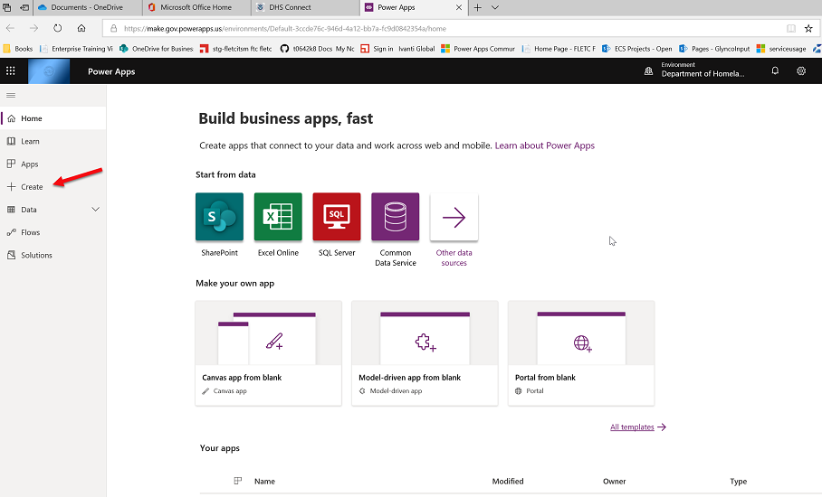
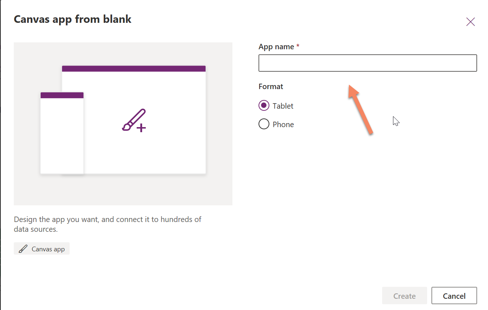
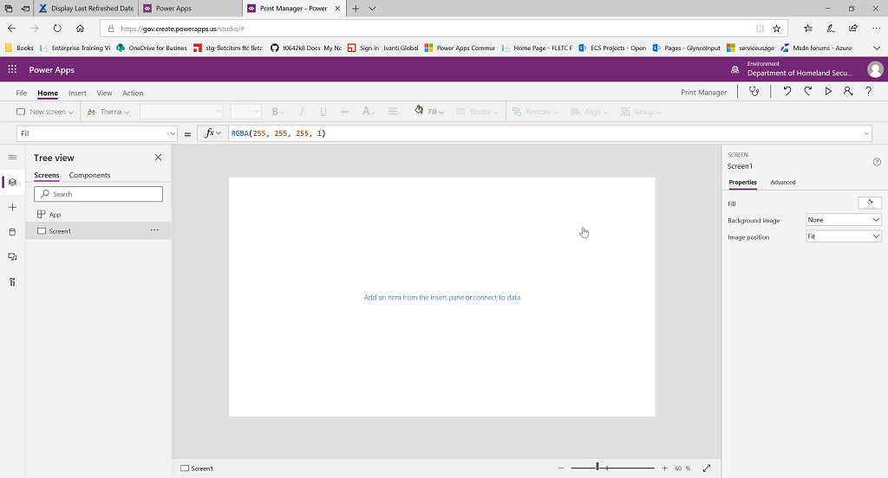

# Print Manager
----------------------------

This program manages your customer print Jobs.

1)  Go to https://www.office.com and login with our orginization's login.

<Table>
  <tr>
    <td>2) Select Power Apps.</td><td></td>
  </tr>
      <tr>
    <td>&nbsp;</td><td>&nbsp;</td>
  </tr>
    <tr>
    <td>3) When the next windows opens Select Create apps (at the red arrow).</td><td></td>
  </tr>
  
  <tr>
    <td>&nbsp;</td><td>&nbsp;</td>
  </tr>
    <tr>
    <td>4) In the dialog box "Canvas from Blank", enter a name for your app It is a good idea not to use spaces in the appname at this point. You will have time later to add spaces. For name enter PrintMaster" Ensure the format is set to Tablet.</td><td></td>
  </tr>  
   <tr>
    <td>5) You should see this screen. On the left is a list of the app compoments. Notice App and screen1 screen are already created for you..</td><td></td>
  </tr>
      <tr>
    <td>&nbsp;</td><td>&nbsp;</td>
  </tr>
    <tr>
    <td>7) When the next windows opens Select Create apps (at the red arrow).</td><td></td>
  </tr>
  
  <tr>
    <td>8) Select Power Apps.</td><td></td>
  </tr>
      <tr>
    <td>&nbsp;</td><td>&nbsp;</td>
  </tr>
    <tr>
    <td>9) When the next windows opens Select Create apps (at the red arrow).</td><td></td>
  </tr>   
  
  </table>
