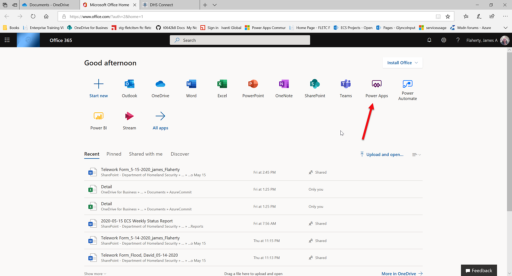

# Print Manager
----------------------------

This program manages your customer print Jobs.

1)  Go to https://www.office.com and login with our orginization's login.

<Table>
  <tr>
    <td>2) Select Power Apps.</td><td></td>
  </tr>
      <tr>
    <td>&nbsp;</td><td>&nbsp;</td>
  </tr>
    <tr>
    <td>3) When the next windows opens Select Create apps (at the red arrow).</td><td></td>
  </tr>
  
  
  </table>
 

4)
