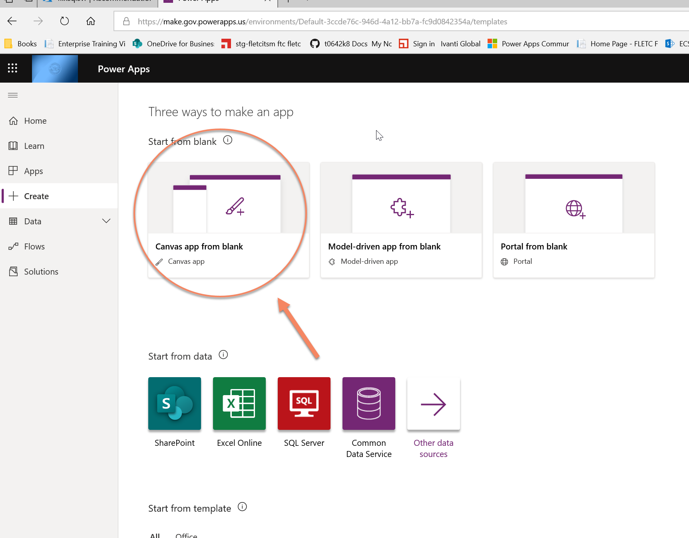

# Print Manager
----------------------------

This program manages your customer print Jobs.

1)  Go to https://www.office.com and login with our orginization's login.

<Table>
  <tr>
    <td>2) Select Power Apps.</td><td></td>
  </tr>
      <tr>
    <td>&nbsp;</td><td>&nbsp;</td>
  </tr>
    <tr>
    <td>3) When the next windows opens Select Create apps (at the red arrow).</td><td></td>
  </tr>
  
  <tr>
    <td>4) Select Power Apps.</td><td></td>
  </tr>
      <tr>
    <td>&nbsp;</td><td>&nbsp;</td>
  </tr>
    <tr>
    <td>5) When the next windows opens, select create apps (at the red arrow).</td><td></td>
  </tr>  
   <tr>
    <td>6) Select canvas Apps.</td><td></td>
  </tr>
      <tr>
    <td>&nbsp;</td><td>&nbsp;</td>
  </tr>
    <tr>
    <td>7) When the next windows opens Select Create apps (at the red arrow).</td><td></td>
  </tr>
  
  <tr>
    <td>8) Select Power Apps.</td><td></td>
  </tr>
      <tr>
    <td>&nbsp;</td><td>&nbsp;</td>
  </tr>
    <tr>
    <td>9) When the next windows opens Select Create apps (at the red arrow).</td><td></td>
  </tr>   
  
  </table>
